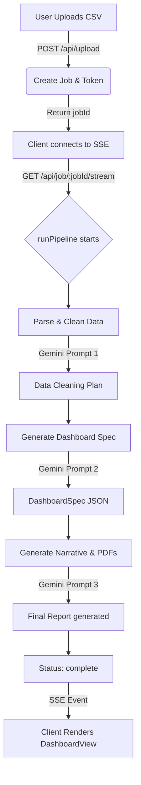
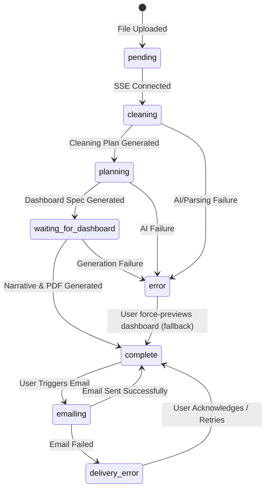
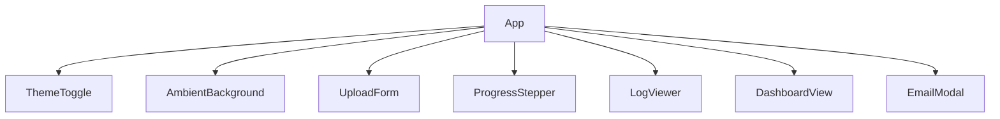

# PROJECT_OVERVIEW.md

## 1. Project Summary
Kriton (v1.2) is a full-stack data analytics application that automatically cleans raw CSV files, plans BI-style dashboards, computes statistics, and generates narrative reports and visual charts using the Gemini AI API. It is designed to act as an automated, AI-driven data analyst that creates interactive client-side reports directly from raw data uploads.

**Tech Stack:**
- **Frontend:** React 19, Vite, Tailwind CSS, Motion (Framer), Recharts, Chart.js, Lucide-React.
- **Backend:** Node.js, Express, esbuild, Multer.
- **AI:** Google Gemini API (`@google/genai`).
- **Exports:** PDF, interactive HTML, technical profiling HTML, cleaned CSV, PNG when available, and ZIP packages.

## 2. Folder & File Structure
```text
.
├── server.ts                       # Backend Express server, API endpoints, SSE streams, and Gemini integration
├── package.json                    # Project dependencies and build scripts
├── src/
│   ├── App.tsx                     # Main React component, handles high-level state, SSE connection, UI routing
│   ├── main.tsx                    # React entry point
│   ├── types.ts                    # Shared TypeScript interfaces (e.g., PipelineJob, DashboardSpec)
│   ├── index.css                   # Global Tailwind CSS entry point
│   ├── components/
│   │   ├── AmbientBackground.tsx   # Decorative background UI component
│   │   ├── DashboardView.tsx       # Renders the dynamic multi-page BI dashboard based on AI specs
│   │   ├── FireSymbol.tsx          # Logo/Icon component
│   │   ├── Loader.tsx              # Loading state spinner
│   │   ├── LogViewer.tsx           # Real-time streaming log display from SSE events
│   │   ├── ProgressStepper.tsx     # Visual progress indicator for pipeline stages
│   │   ├── ThemeToggle.tsx         # Dark/Light mode switcher
│   │   └── UploadForm.tsx          # File dropzone, preview, and upload initiation
│   ├── config/
│   │   └── prompts.ts              # Text templates for AI instructions (Cleaning, Dashboard, Narrative)
│   └── utils/
│       ├── data-processing.ts      # CSV parsing, basic statistics computation, and data sampling
│       ├── html-generator.ts       # Generates static HTML analytics reports
│       ├── pdf-generator.ts        # PDF generation using pdfkit and chartjs-node-canvas
│       ├── logger.ts               # Server-side logging utility
│       └── retry.ts                # Exponential backoff wrapper for API stability
```

## 3. End-to-End Workflow
1. **Upload:** User uploads a CSV, Excel, or JSON file via `UploadForm.tsx`. `POST /api/upload` (in `server.ts`) creates a `PipelineJob`, assigns a `jobToken`, and responds with `jobId`.
2. **SSE Connection:** `App.tsx` opens an SSE connection to `GET /api/job/:jobId/stream`. Once connected, the server kicks off `runPipeline()` asynchronously.
3. **Clean (Stage 2):** `runPipeline()` calls `data-processing.ts` to parse the CSV, compute stats, and send the `CLEANING_PROMPT` to Gemini (`server.ts:generateCachedContent`). It parses the JSON response and programmatically cleans/transforms the data.
4. **Plan Dashboard (Stage 3):** The server computes stats on the cleaned data and prompts Gemini with `DASHBOARD_PROMPT` to generate a `DashboardSpec` (pages, KPIs, charts).
5. **Analyze & Build (Stage 4):** The server calculates exact KPI values, queries Gemini with `NARRATIVE_PROMPT` to write a text report, and simultaneously builds static HTML and PDF files (`html-generator.ts`, `pdf-generator.ts`). 
6. **Delivery/Complete:** Status becomes `complete`, the client receives the spec via SSE, and `DashboardView.tsx` renders the interactive dashboard.



## 4. State Machine
Valid job statuses (from `src/types.ts`): `pending`, `cleaning`, `planning`, `waiting_for_dashboard`, `emailing`, `complete`, `error`, `delivery_error`.



## 5. API Reference
| Method | Path | Purpose | Auth / Token Required | Request | Response |
|---|---|---|---|---|---|
| POST | `/api/upload` | Upload CSV and initialize pipeline job. | None | `multipart/form-data` | `{ jobId, jobToken }` |
| GET | `/api/job/:jobId/stream` | Server-Sent Events (SSE) stream for status, logs, and data. | Yes (`?token=` or header) | N/A | `text/event-stream` |
| GET | `/api/job/:jobId/download/:fileType` | Download generated files (csv, png, pdf, html, zip). | Yes (`?token=` or header) | N/A | File binary |
| POST | `/api/job/:jobId/chat` | Chat with AI about the dataset context. | Yes (`jobToken` body field) | `{ message, jobToken }` | `{ reply }` |
| POST | `/api/job/:jobId/email` | Record an email delivery request. | Yes (`x-job-token`, body, or query) | `{ to, attachments }` | `{ success }` |
| DELETE| `/api/job/:jobId` | Delete job data from server memory. | Yes (`x-job-token` header) | N/A | `{ success }` |

## 6. AI / Gemini Integration
All calls happen in `server.ts` utilizing `@google/genai` with model `gemini-3.5-flash`. Wrapped in `withRetry` exponential backoff.
1. **Cleaning Plan** (Stage 2): `runPipeline` uses `CLEANING_PROMPT` (`src/config/prompts.ts`). Expects JSON schema representing data column types and outliers. *Fallback: logs error and falls back to raw data without cleaning.*
2. **Dashboard Spec** (Stage 3): `runPipeline` uses `DASHBOARD_PROMPT`. Expects JSON schema for `DashboardSpec`. *Fallback: Generates a heuristic single-page dashboard spec without AI.*
3. **Narrative Generation** (Stage 4): `runPipeline` uses `NARRATIVE_PROMPT`. Expects plain text / markdown. *Fallback: Replaces with static failure text.*
4. **Chat** (`POST /api/job/:jobId/chat`): Uses hardcoded prompt string combining Schema, Stats, Sample + `message`. Expects markdown string. *Fallback: 500 error returned to client.*

## 7. Data Model
*Extracted directly from `src/types.ts`*

```typescript
export interface PipelineJob {
  id: string;
  jobToken: string;
  email: string;
  fileName: string;
  originalBuffer: Buffer;
  cleanedData?: any[];
  stats?: any;
  cleaningLog?: string;
  dashboardSpec?: DashboardSpec;
  status: 'pending' | 'cleaning' | 'planning' | 'waiting_for_dashboard' | 'emailing' | 'complete' | 'error' | 'delivery_error';
  dashboardImage?: string; // base64 data url
  reportText?: string;
  reportPdf?: Buffer;
  reportHtml?: Buffer;
  accessToken?: string;
}

export interface DashboardSpec {
  pages: DashboardPage[];
}

export interface DashboardPage {
  id: string;
  title: string;
  kpis: { label: string; field: string; agg: 'sum' | 'avg' | 'min' | 'max' | 'count'; }[];
  charts: { id: string; type: 'line' | 'bar' | 'pie'; title: string; chartTitle?: string; xAxisLabel?: string; yAxisLabel?: string; x: string; y: string; agg: 'sum' | 'avg' | 'min' | 'max' | 'count'; filter?: string; }[];
  insights: string[];
}
```

## 8. Frontend Component Map
- **App** (`src/App.tsx`): Main wrapper. Manages job state (`jobId`, `jobStatus`), sets up SSE listener, and routes view between `UploadForm` and `DashboardView`.
- **UploadForm** (`src/components/UploadForm.tsx`): Handles drag-and-drop file inputs, CSV preview, sample data, and POSTs to `/api/upload`.
- **DashboardView** (`src/components/DashboardView.tsx`): Given a `DashboardSpec` and `data` array, renders KPIs, Recharts charts, and the AI narrative.
- **ProgressStepper** (`src/components/ProgressStepper.tsx`): Dumb visual component reflecting current pipeline stage.
- **LogViewer** (`src/components/LogViewer.tsx`): Dumb list component showing live SSE logs.



## 9. Security Model (current state)
- **Authentication**: When a file is uploaded, a random `jobToken` string is generated and returned to the client. The client must pass it as `?token=` or an `x-job-token` header to subsequent requests.
- **Endpoint authorization**: Job status, SSE, downloads, chat, email, refresh, and deletion require the job token. The upload endpoint is intentionally unauthenticated.
- **Persistence & encryption**: Jobs are kept in memory and serialized under `.data/jobs` for restart recovery. Stored files and job tokens are not encrypted at rest, so deployment storage must be protected.

## 10. Known Limitations / Open Issues
- **Single-process job storage**: Jobs are stored in one process and cleaned up after 24 hours. This is not suitable for horizontally scaled deployment without a shared store.
- **Email delivery**: The current email endpoint records and acknowledges a request but does not send mail; an email provider integration is still required.
- **Dashboard PNG**: `job.dashboardImage` is supported by download/ZIP logic but is not populated by the current dashboard flow.
- **Spreadsheet dependency**: `xlsx` has known unresolved audit findings and should be replaced or isolated before processing untrusted workbooks at scale.

## 11. How to Run Locally
**Prerequisites:** Node.js 18+ installed.

1. **Environment Variables:** Create a `.env` file at the root.
   ```env
   GEMINI_API_KEY=your_gemini_api_key
   ```
   `GEMINI_API_KEY` is required for AI-powered cleaning, dashboard planning, narrative generation, and chat.

2. **Installation:**
   ```bash
   npm install
   ```

3. **Running (Development):**
   ```bash
   npm run dev
   ```

4. **Running (Production Build):**
   ```bash
   npm run build
   npm start
   ```
